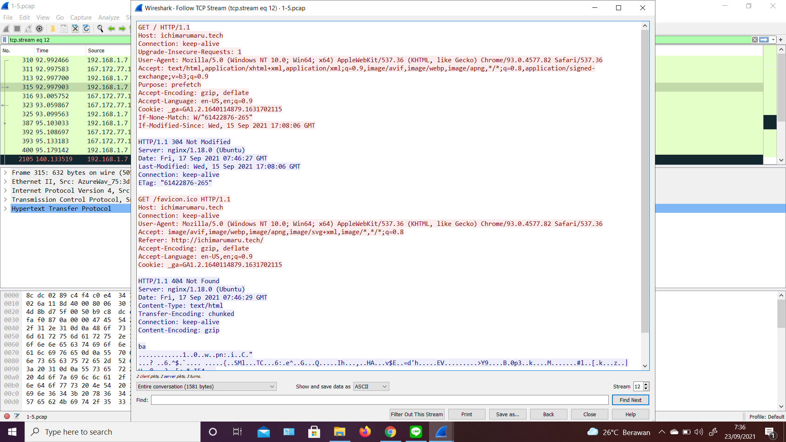
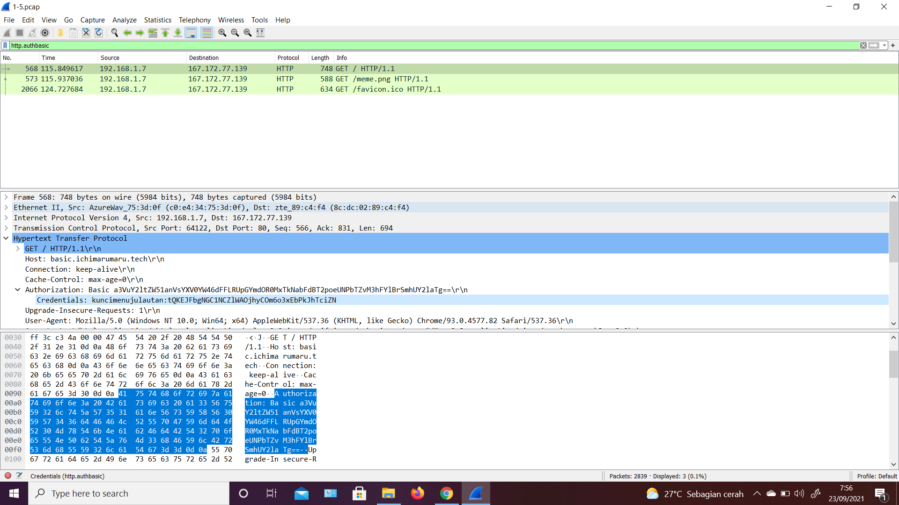
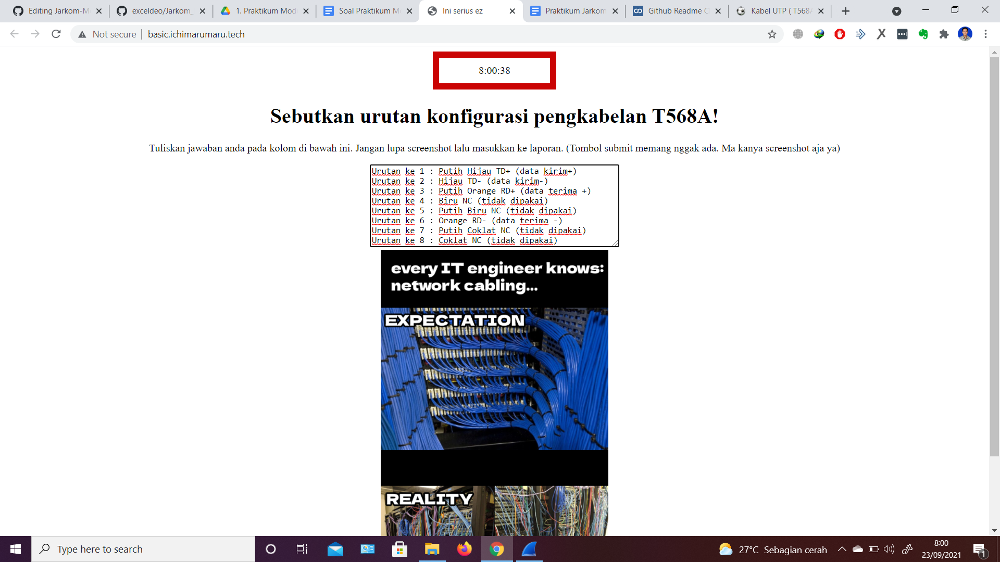
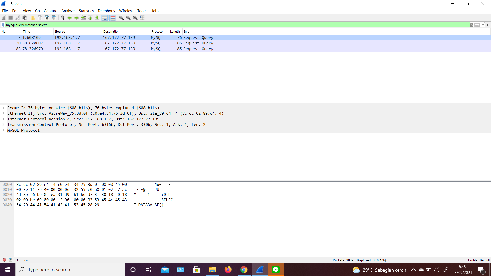
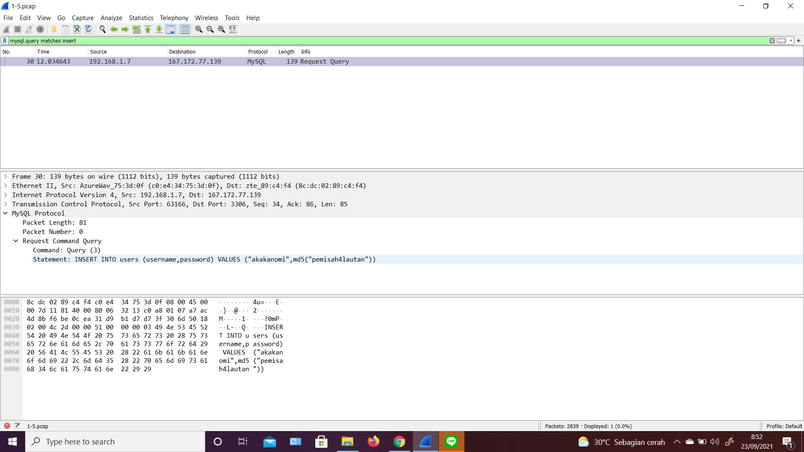
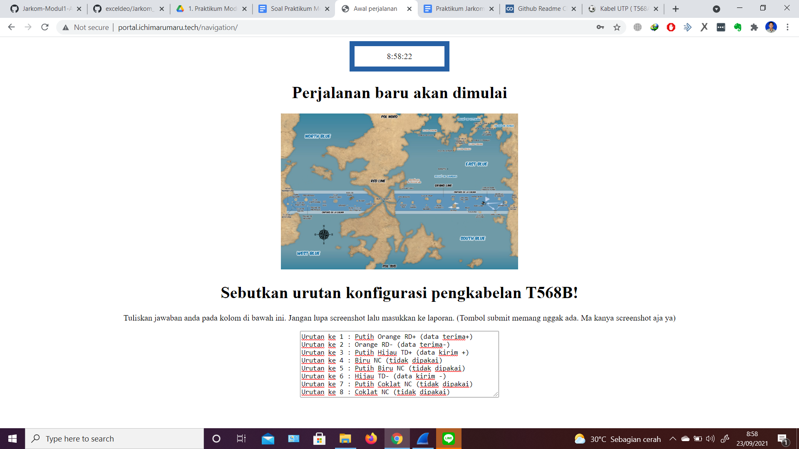
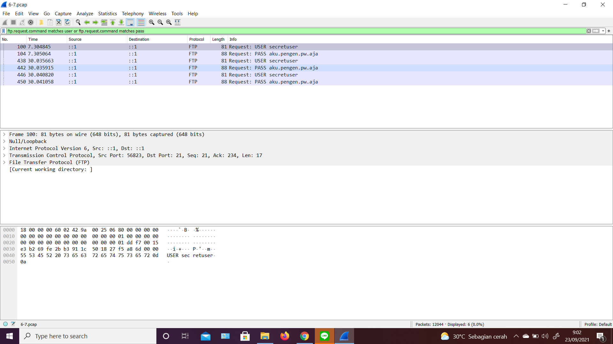
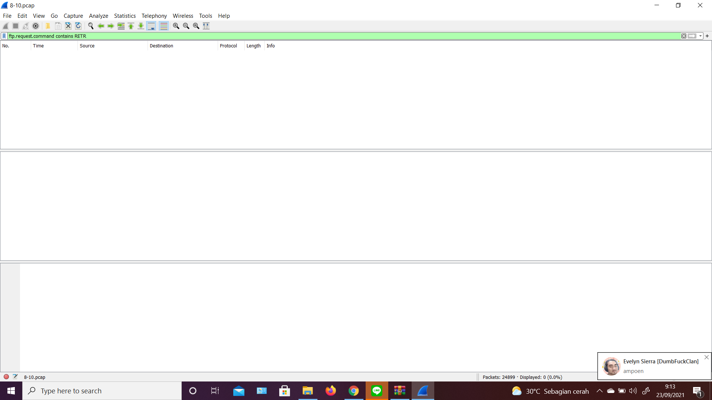

# Jarkom-Modul1-A15-2021
Laporan Resmi 1 Modul 1 Jaringan Komputer

## Kelompok A15
- Aimar Wibowo (05111940000034)
- Ifanu Antoni (05111940000064)

### No. 1
1. Filter : http.host contains ichimarumaru.tech
2. Klik kanan pada salah satu paket, lalu pilih follow TCP Stream
3. Akan terlihat web server yang digunakan, yaitu nginx/1.18.0 (Ubuntu)

### No. 2
### No. 3
1. Filter : http.authbasic
2. Menuju Hypertext Transfer Protocol, lalu ke Authorization, ada credentials disana.
3. Username : kuncimenujulautan, Password : tQKEJFbgNGC1NCZlWAOjhyCOm6o3xEbPkJhTciZN

4. Masuk ke website basic.ichimarumaru.tech sesuai dengan username dan password di atas, maka akan tampil halaman seperti ini

### No. 4
1. Filter : mysql.query matches select

### No. 5
1. Filter : mysql.query matches insert
2. Username : akakanomi, Password : pemisah4lautan

3. Login ke portal.ichimarumaru.tech, maka akan tampil halaman seperti ini

### No. 6
1. Filter : ftp.request.command matches user or ftp.request.command matches pass
2. Username : secretuser, Password : aku.pengen.pw.aja

### No. 7
1. Filter : frame contains Real.pdf
2. Klik kanan pada salah satu paket, lalu pilih follow TCP Stream
3. Show and save data as Raw
4. Save as Real.zip
5. Buka file zip yang sudah didownload, maka akan tampil seperti ini

### No. 8
1. Filter : ftp.request.command contains RETR

### No. 9
1. Filter : ftp-data
2. Mencari paket data yang berisi secret.zip
3. Klik kanan, lalu follow TCP Stream
4. Show and save data as Raw
5. Save as secret.zip

### No. 10
### No. 11
### No. 12
### No. 13
### No. 14
### No. 15
