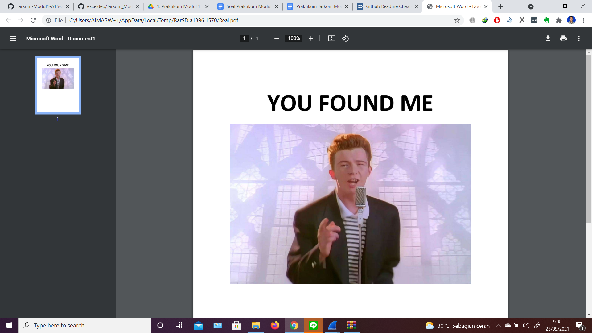
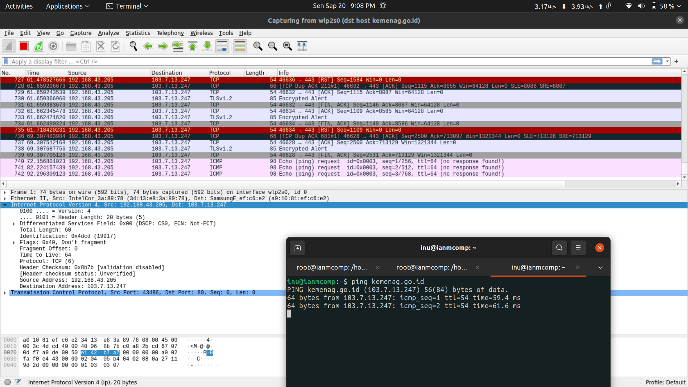

# Jarkom-Modul1-A15-2021
Laporan Resmi 1 Modul 1 Jaringan Komputer

## Kelompok A15
- Aimar Wibowo (05111940000034)
- Ifanu Antoni (05111940000064)

### No. 1
1. Filter : http.host contains ichimarumaru.tech
2. Klik kanan pada salah satu paket, lalu pilih follow TCP Stream
3. Akan terlihat web server yang digunakan, yaitu nginx/1.18.0 (Ubuntu)

### No. 2
  Untuk menemukan paket dari web-web yang menggunakan basic authentication method,   
  bisa menggunakan display filter http.authbasic  
  Berikut adalah paket basic authentication method yang ada di basic.ichimarumaru.tech  
  

### No. 3
1. Filter : http.authbasic
2. Menuju Hypertext Transfer Protocol, lalu ke Authorization, ada credentials disana.
3. Username : kuncimenujulautan, Password : tQKEJFbgNGC1NCZlWAOjhyCOm6o3xEbPkJhTciZN

4. Masuk ke website basic.ichimarumaru.tech sesuai dengan username dan password di atas, maka akan tampil halaman seperti ini

### No. 4
1. Filter : mysql.query matches select

### No. 5
1. Filter : mysql.query matches insert
2. Username : akakanomi, Password : pemisah4lautan

3. Login ke portal.ichimarumaru.tech, maka akan tampil halaman seperti ini

### No. 6
1. Filter : ftp.request.command matches user or ftp.request.command matches pass
2. Username : secretuser, Password : aku.pengen.pw.aja

### No. 7
1. Filter : frame contains Real.pdf
2. Klik kanan pada salah satu paket, lalu pilih follow TCP Stream
3. Show and save data as Raw
4. Save as Real.zip
5. Buka file zip yang sudah didownload, maka akan tampil seperti ini

### No. 8
1. Filter : ftp.request.command contains RETR

### No. 9
1. Filter : ftp-data
2. Mencari paket data yang berisi secret.zip
3. Klik kanan, lalu follow TCP Stream
4. Show and save data as Raw
5. Save as secret.zip

### No. 10
1. Filter : ftp-data.command contains history
2. Filter : ftp-data.command contains bukanapaapa.txt
3. Akan terlihat password : d1b1langbukanapaapajugagapercaya

4. Buka file secret.zip sesuai password di atas, maka akan tampil seperti ini

### No. 11
  Untuk mengambil paket yang berasal dari port 80, bisa menggunakan capture filter : tcp src port 80  
  

### No. 12
  Untuk mengambil paket yang mengandung port 21, bisa menggunakan capture filter : tcp port 21 ,   
  disini terlebih dahulu dijalankan filezilla. Setelah itu, bisa menggunakan capture filter tcp port 21  
  

### No. 13
  Untuk menampilkan paket yang menuju port 443, bisa menggunakan capture filter : dst port 443  
  

### No. 14
  Untuk mengambil paket yang tujuannya ke kemenag.go.id, bisa menggunakan capture filter : dst host kemenag.go.id  
  

### No. 15
1. cek ip laptop kita dengan ifconfig  
  
   diketahui ip laptop adalah 192.168.100.33  
2. kemudian menggunakan capture filter : src host 192.168.100.33  
  

## Kendala yang dialami
1. Jaringan internet yang lambat
